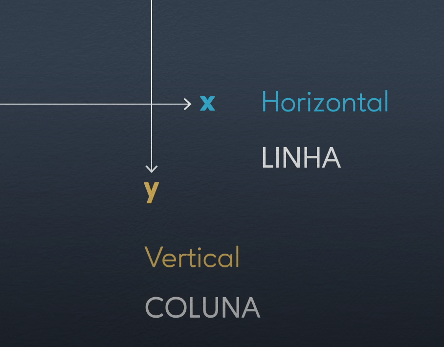
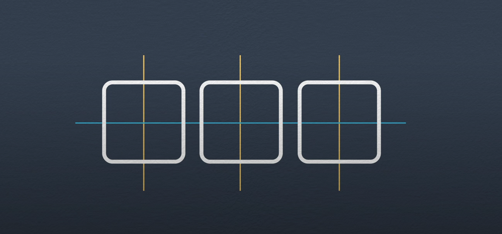
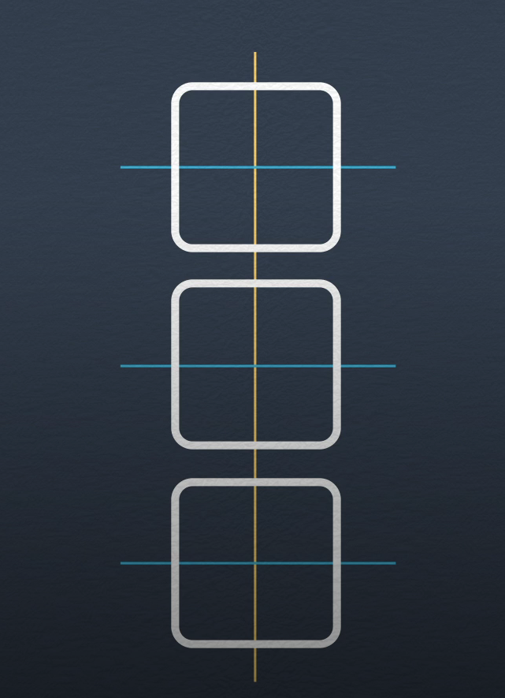
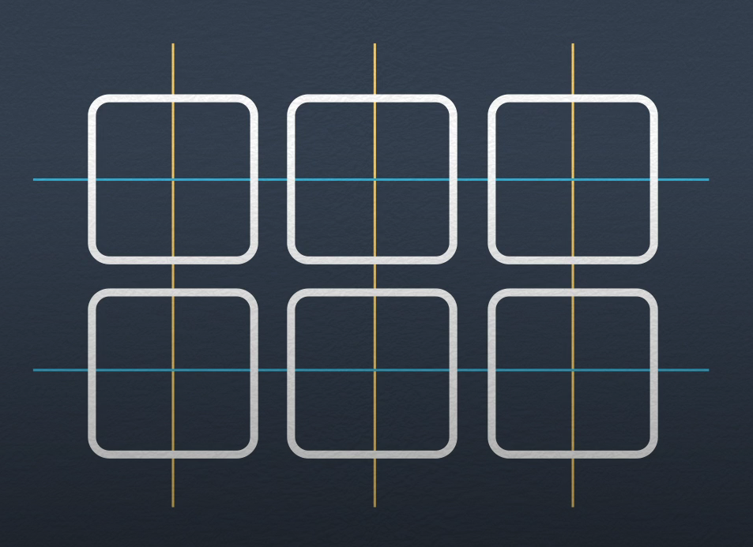
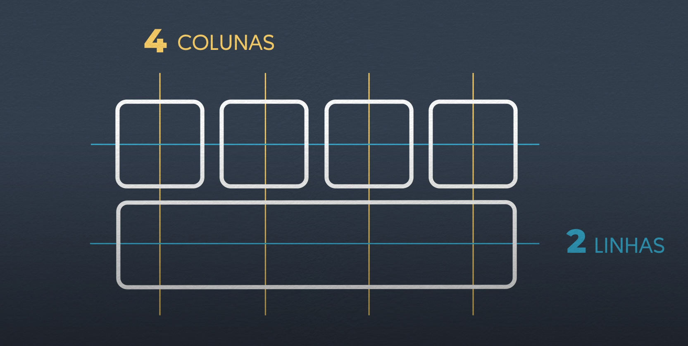
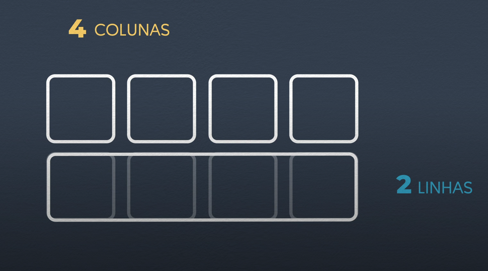

# Anotação CSS GRID LAYOUT

HTML constrói elementos em forma de pilhas, a um tempo a organização de layout era feita por tabelas, sendo que uso correto das tabelas são para organizar informações textuais e não para layout, e essa prática acabou sendo ultrapassa, usando recursos CSS como `float`, `position`, `ìnline-block`, mas era consideradas como gambiarras, depois disso nasceu o recursos flex-box, usado para colocar elementos lado a lado mas de forma mais flexivel, dizendo como os elementos podem se comporta, só que de forma unidimensional (exportos de linha reta), em cima dessa limitação, surgiu o CSS GRID LAYOUT, dando recursos para desenvolver layouts bidirecional e complexos.

## Interpretando o grid

Antes de ir para prática, é bom entender como o grid layout se comporta a estrutura

As estrutura são organizadas por linhas e colunas exemplo:

### Exemplo de extrutura simples

Exemplo de estrutura 1

> 1 linha e 3 colunas

Exemplo de estrutura 2

> 3 linhas e 1 coluna

Exemplo de estrutura 3

> 2 linhas e 3 colunas

### Exemplo de extrutura complexas

Exemplo de estrutura 4

> 2 linhas e 4 colunas

É como no CSS GRID LAYOUT que um elemento pode ocupar espaço de 4 colunas dando mais flexibilidade em organizar-los exemplo:

Exemplo de estrutura 5

Sendo assim definimos as colunas e linhas sempre pela maior quantidade.
